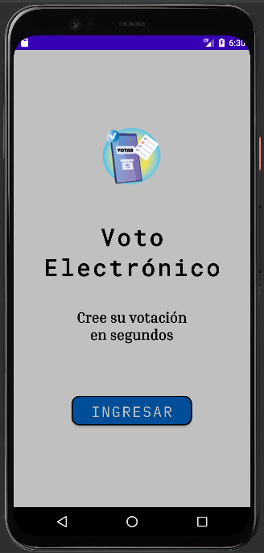
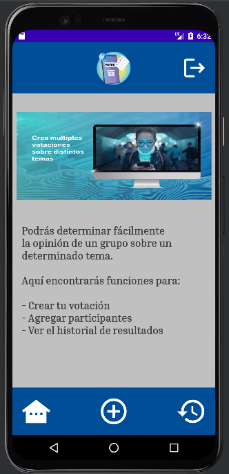
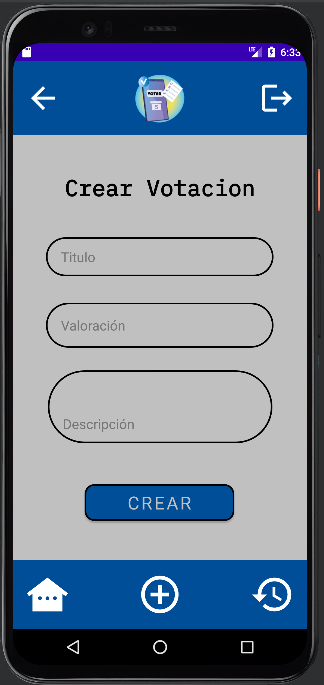
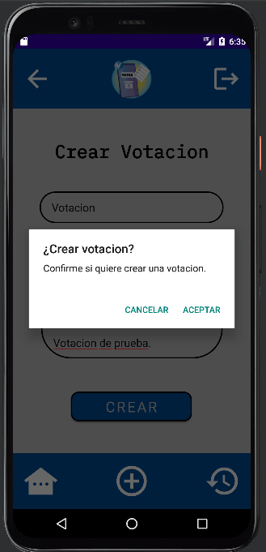
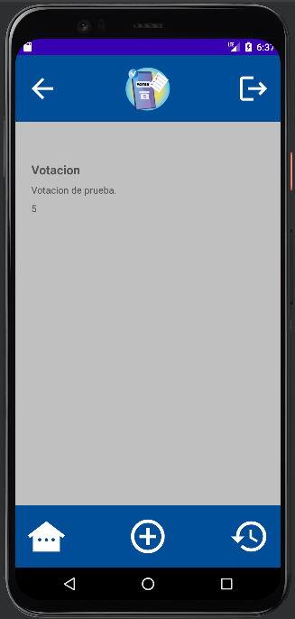
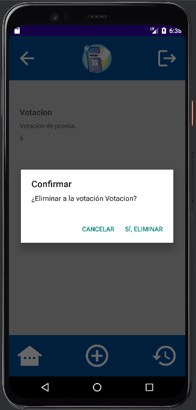
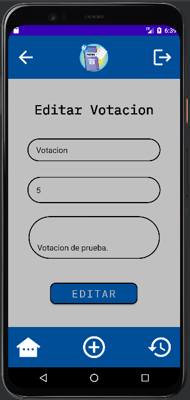
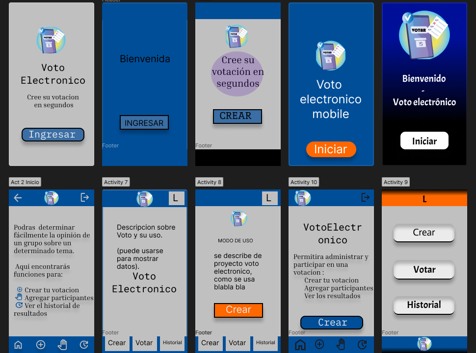

<a name="inicio"></a>
<br>
<div align="center">
    
  </a>

## <h1 align="center">Proyecto: Voto App</h1>
  <br>

 
  
</div>


<!-- Contenido -->
<details>
<summary><h2>Click aqui para navegación rápida</h2></summary>
  <ol>
    <li>
      <a href="#sobre">Sobre</a>
      <ul>
        <li><a href="#tecnologías">Tecnologias utilizadas en el proyecto</a></li>
        <li><a href="#figma">Trabajo en equipo durante fase de diseño con Figma</a></li>
      </ul>
    </li>
    <li>
      <a href="#iniciando">Iniciando el proyecto</a>
      <ul>
        <li><a href="#pre-requisitos">Pre-requisitos</a></li>
        <li><a href="#instalacion">Instalación</a></li>
      </ul>
    </li>
    <li><a href="#uso">Uso</a></li>
    <li><a href="#estado">Estado actual</a></li>
    <li><a href="#contacto">Contacto</a></li>
    <li><a href="#utiles">Material útil</a></li>
  </ol>
</details>

<br>
<br>

<!--------------------------------- SOBRE & CAPTURAS --------------------------------->
## Sobre
<br>
El proyecto de 'Voto App' podrás determinar votaciones de manera simple y sencilla sobre lo que desees y tener acceso a ello cuando desees. Tendrás funciones para crear, editar y ver en tu historial los datos que guardaste. Dentro del historial podrás borrar si asi quieres alguna votación.
A continuación verás capturas de la app funcionando.
<br/>
<br>
<table>
  <tr>
    <td></td>
    <td></td>
  </tr>
  <tr>
    <td></td>
    <td></td>        
  </tr>
  <tr>
    <td></td>
    <td></td>
    <td></td>
  </tr>
</table>

<br />

<p align="right">(<a href="#inicio">Ir arriba</a>)</p>


## Figma
<br>
Aqui veremos capturas en la fase de diseño del grupo con las ideas que teniamos sobre como podría llegar a ser la aplicación en cuanto al diseño en general.
<br>
<br>



<br>
<br>

<p align="right">(<a href="#inicio">Ir arriba</a>)</p>

## Tecnologías
<br>

Aqui adjuntamos las tecnologías utilizadas para el proyecto con su correspondiente link al sitio.
 <br>
 <br>
 [![Auth0][Auth0.io]][Auth0-url] 
 <br>
 <br>
 [![AndroidStudio][AndroidStudio.com]][AndroidStudio-url] 
 <br>
 <br>
 [![java][java.com]][java-url] 
 <br>
 <br>
 [![mysql][mysql.com]][mysql-url] 
 <br>
 <br>
 
<p align="right">(<a href="#inicio">Ir arriba</a>)</p>

<br>
<br>

<!-- INICIANDO EL PROYECTO -->
## Iniciando
<br>

Aqui veremos los pasos para iniciar de manera sencilla el proyecto de forma local.

## Pre-requisitos
<br>
<br>
Instalaciones necesarias para el correcto funcionamiento.

* Android Studio
  ```sh
  Instalar Android Studio
  ```

 ```sh
  Para su correcta visualización utilizar emulador en version "PIXEL 4 Api 24"
 ```

## Instalacion 

1. Clonar el repo
   ```sh
   git clone https://github.com/Full-Juan-Ortega/VotoElectronicoAndroid.git
   ```
   
## Instrucciones para ejecutarlo
<br>
<br>

1. Abrir el proyecto descargado con Android Studio.

2. IMPORTANTE antes de emular.
   ```sh
   Utilizar "PIXEL 4 Api 24" para emular.
   ```

3. Lanzar proyecto
   ```sh
   Darle a play para iniciar emulación en Android Studio.
   ```

4. Utilizar Credenciales de prueba para loguearse.
   
   ```sh
   usuario: "carlos@gmail.com" 
   clave: "carlos123-4"
   Nota: Los datos van SIN comillas.
   ```
   

<p align="right">(<a href="#inicio">Ir arriba</a>)</p>


<!-- USOS -->
## USO
<br>
<br>
El usuario debe abrir la aplicación, desde ahi con el botón "INGRESAR" ingresar a la parte de login/registro.  

Luego de concretado el login se habilita el acceso a la aplicación y todas sus funcionalidades.  

Desde la aplicación se podrán "CREAR" votaciones en la cual se pediran los datos de "TITULO", "VALORACION" y "DESCRIPCION" luego de esto se guarda automaticamente la información que será accesible en todo momento ingresando a la opción de "HISTORIAL".  

Desde el historial se podrán "ELIMINAR" (manteniendo apretado en lo que quiera eliminar en la tabla de historial) o "EDITAR" los datos (presionar una vez y soltar en lo que se quiera editar en la tabla).  

Siempre al querer "CREAR", "ELIMINAR" o "EDITAR" información aparecerá una alerta de confirmación para consultar si el usuario quiere o no aplicar los cambios y asi evitar errores accidentales.  


<p align="right">(<a href="#inicio">Ir arriba</a>)</p>


<!-- Estado actual del proyecto -->
## Estado

### Sprint Final

- [x] Tener página de inicio la cuál será el inicio de la aplicación y desde la que se pueda redireccionar hacia diferentes partes de la aplicación.
- [x] Mantener un estilo coherente entre estilos, colores, iconos, imágenes, etc.
- [x] Navegación entre las distintas Activities debe estar bien definida y en todo momento se debe poder volver desde una activity hija a su padre.
- [x] Se debe involucrar un proceso de traspaso de información entre activities.
- [x] Se debe implementar algún tipo de persistencia de datos para almacenar información de procesos.
- [x] Considerar utilizar algún servicio de autenticación como Auth0 para la autenticación.
- [x] La app debe implementar algún tipo de recurso multimedia (video).
- [x] Mantener actualizado GitHub.
- [x] Versión final del proyecto.
 

 
Aqui puedes observar las [Issues](https://github.com/Full-Juan-Ortega/VotoElectronicoAndroid/issues) creadas para la conclusión del proyecto.

<p align="right">(<a href="#inicio">Ir arriba</a>)</p>


<!-- Contacto -->
## Contacto

<br>
<br />

### Hilario Iñigo Menéndez Picossi 

Proyectos: [https://github.com/hpicossi](https://github.com/hpicossi)

<br />

### Marcos Javier Gómez 

Proyectos: [https://github.com/wesborland-github](https://github.com/wesborland-github)

<br />

### Florencia Bravo Corvalán 

Proyectos: [https://github.com/FlorenciaCorvalan](https://github.com/FlorenciaCorvalan)

<br />

### Juan Ortega

Proyectos: [hhttps://github.com/Full-Juan-Ortega](https://github.com/Full-Juan-Ortega)

<br />

### Lucas Bartolone

Proyectos: [https://github.com/LucasBartolone](https://github.com/LucasBartolone)

<br />

<p align="right">(<a href="#inicio">Ir arriba</a>)</p>


<!-- Links útiles -->
## Utiles

Recursos utiles al momento de crear el proyecto (agradecimientos a los creadores de tales recursos);

* [Android Studio](https://developer.android.com/)
* [Auth0](https://auth0.com/)
* [Figma](https://www.figma.com/)
* [Google Fonts](https://fonts.google.com/)


<p align="right">(<a href="#inicio">Ir arriba</a>)</p>


<!-- Imagenes -->

[Auth0.io]: https://img.shields.io/badge/Auth0-black?style=for-the-badge&logo=auth0&logoColor=white
[Auth0-url]: https://auth0.com/
[AndroidStudio.com]: https://img.shields.io/badge/androidstudio-3DDC84?style=for-the-badge&logo=androidstudio&logoColor=white
[AndroidStudio-url]: https://developer.android.com/
[mysql.com]: https://img.shields.io/badge/MySQL-blue?style=for-the-badge&logo=MySQL&logoColor=FFF
[mysql-url]: https://www.mysql.com/
[java.com]: https://img.shields.io/badge/java-FF160B?style=for-the-badge
[java-url]: https://www.java.com/


<!-- FIN -->
